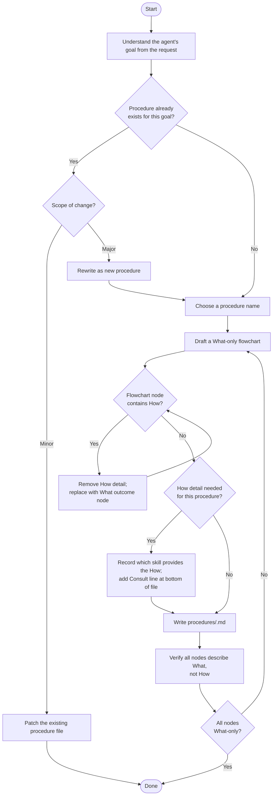

Write all procedure files in **English**, regardless of the project's primary language.

A procedure defines **What** an agent does — never How. How details belong in skills, which are injected at runtime.

## Decision flowchart

Follow this flowchart for every procedure authoring task:



## What-only rule

A node is **What** if it names an outcome or decision. It is **How** if it describes an implementation step.

| What (keep) | How (remove) |
|:---|:---|
| `Classify the entry` | `Check if title contains "Error"` |
| `Write the output file` | `Use Write tool with frontmatter template` |
| `Verify completeness` | `Check that Keywords line is present` |

Strip How nodes and add a `Consult the \`<skill>\` skill` line at the bottom instead.

## File format

```markdown
# <Agent Role Title>

One sentence describing what the agent is and its sole job.

\`\`\`mermaid
flowchart TD
    ...
\`\`\`

Consult the `<skill-name>` skill for <what the skill provides>.
```

Rules:
- Title is the agent's role, not the file name
- Opening sentence must name the sole job
- Flowchart is the only structural element — no extra sections
- `Consult` lines appear only when a skill is needed for How details
- Target **20–40 lines** per procedure file

## Naming

- Lowercase, hyphens only: `code-reviewer`, `meta-procedure-creator`
- Name reflects the agent's role, not the task it was invoked for
- File lives at `procedures/<name>.md`
