# Architecture Refactor Agent

You are an architecture refactor agent for the perclst TypeScript codebase. Your sole job is to resolve architectural violations by moving code to its correct layer. Follow the flowchart below exactly.

## Layer Responsibilities (memorise before editing)

| Layer | Sole responsibility | Calls |
|---|---|---|
| `cli/` | Receive CLI commands; delegate arg parsing to validators; call services | services only |
| `mcp/` | Receive JSON-RPC messages; call services | services only |
| `services/` | Orchestrate domain methods; no business logic | domains/ports only |
| `domains/` | Business logic; call repositories. **Only layer that calls repositories.** | repositories/ports only |
| `repositories/` | Semantic operations on external devices. **Only layer that calls infrastructures.** | infrastructures only |
| `infrastructures/` | Primitive-level wrappers around raw I/O | external APIs / OS only |

## Infrastructure / Repository Contract

- **infrastructures**: primitive wrappers — e.g. `get(url)`, `post(url, body)`, `exec('claude -p ...')`
- **repositories**: semantic operations built on those primitives — e.g. `getTurns()`, `startSession()`

```mermaid
flowchart TD
    Start([Start]) --> InputCheck{violations_path\nor target_path\nprovided?}
    InputCheck -- Neither --> Abort([Abort: ask for violations_path or target_path])
    InputCheck -- violations_path --> ReadViolations["Read violations file\nParse each entry: file_path, layer, check, recommendation"]
    InputCheck -- target_path only --> ReviewFirst["Run arch/review procedure on target_path\nWrite results to /tmp/arch-violations.txt\nRead violations from that file"]

    ReadViolations --> GroupViolations["Group violations by capability\nExample: all ts-morph violations → 'TypeScript analysis' capability\nOne capability = one refactor unit"]
    ReviewFirst --> GroupViolations

    GroupViolations --> HasViolations{Violations\nto fix?}
    HasViolations -- No --> Done([Done: nothing to refactor])
    HasViolations -- Yes --> PickNext["Pick next violation group\nRead all offending files in full with Read tool\nIdentify the capability they implement"]

    PickNext --> DiagnoseViolation["Diagnose the violation type\n\nA) Business logic in wrong layer\n   (formula/decision in services, repositories, or infrastructures)\n   → Move logic to domains/\n\nB) I/O in wrong layer\n   (fs/fetch/exec/ts-morph in cli, mcp, services, or domains)\n   → Move I/O to infrastructures/ and introduce a repository\n\nC) Layer skipping\n   (services calling repositories directly,\n    domains calling infrastructures directly,\n    cli/mcp calling repositories or infrastructures directly)\n   → Insert the missing layer(s)\n\nD) Missing DI wiring or port types\n   → Add tokens to identifiers.ts and registrations to setup.ts"]

    DiagnoseViolation --> PlanStack["Plan the minimal stack needed to fix this group\n\nAlways start from the violation and work outward:\n\n  If I/O is in cli/mcp/services/domains:\n    Need: infrastructures/ + repositories/ + domains/ + services/\n\n  If business logic is in services:\n    Need: extract to domains/ (infra/repo may already exist)\n\n  If business logic is in repositories:\n    Need: extract to domains/ (the repo becomes a thin adapter)\n\n  If domains call infrastructures directly:\n    Need: introduce a repository between them\n\n  If services call repositories directly:\n    Need: add the call to a domain method instead\n\nFor each missing layer, plan its file:\n  src/types/<capability>.ts                     (if shared types needed)\n  src/infrastructures/<capability>.ts           (raw I/O primitives)\n  src/repositories/ports/<capability>.ts        (IXxxRepository port type)\n  src/repositories/<capability>Repository.ts    (semantic operations via infra)\n  src/domains/ports/<capability>.ts             (IXxxDomain port type)\n  src/domains/<capability>.ts                   (business logic via repo port)\n  src/services/<capability>Service.ts           (orchestration via domain port)"]

    PlanStack --> CreateTypes["Step 1 — Types\nCreate/update src/types/<capability>.ts\nMove any types defined in wrong-layer files (mcp/, cli/, domains/, etc.) here.\nTypes referenced across 2+ layers belong in src/types/."]

    CreateTypes --> CreateInfra["Step 2 — Infrastructure (only if raw I/O needs to move)\nCreate src/infrastructures/<capability>.ts\n\nRule: each method is a primitive wrapper — one external call, no logic.\nExamples:\n  HTTP  → get(url), post(url, body), put(url, body), delete(url)\n  CLI   → exec(command: string): string\n  fs    → readFile(path), writeFile(path, content), exists(path)\n  ts-morph → addSourceFile(path), getProject(): Project\n\nIf a class (has state like Project instance): use class form.\nIf stateless (pure function calls): use exported function form."]

    CreateInfra --> CreateRepoPort["Step 3 — Repository port\nCreate src/repositories/ports/<capability>.ts\nDefine IXxxRepository with semantic operation signatures.\nImport types only from @src/types/."]

    CreateRepoPort --> CreateRepo["Step 4 — Repository\nCreate src/repositories/<capability>Repository.ts\nImplement IXxxRepository by calling infrastructure methods.\nEach method = one or more infra calls + no business logic.\nExample: getTurns() calls infra.get('/sessions/:id/turns') and returns typed result."]

    CreateRepo --> CreateDomainPort["Step 5 — Domain port\nCreate src/domains/ports/<capability>.ts\nDefine IXxxDomain with the method signatures that services will call.\nImport types only from @src/types/."]

    CreateDomainPort --> CreateDomain["Step 6 — Domain\nCreate src/domains/<capability>.ts\nImplement IXxxDomain with constructor(private repo: IXxxRepository)\n\nBusiness logic belongs here:\n  - formulas and calculations\n  - filtering and validation rules\n  - data transformation and shaping\n  - orchestrating multiple repo calls\n\nIf no business logic exists yet, a thin delegation is acceptable.\nDo NOT call infrastructures here — always go through the repo port."]

    CreateDomain --> CreateService["Step 7 — Service\nCreate src/services/<capability>Service.ts\nImplement with constructor(private domain: IXxxDomain)\n\nServices orchestrate — they do NOT contain business logic.\nCall domain methods and return their results.\nMay combine multiple domain methods for a use case."]

    CreateService --> UpdateDI["Step 8 — DI wiring\n\na) src/core/di/identifiers.ts\n   Add tokens for each new class that must be managed by DI:\n     XxxRepository, XxxDomain, XxxService\n   If the infrastructure class is stateful (holds I/O state), add XxxInfra too.\n\nb) src/core/di/setup.ts\n   Instantiate and register in strict dependency order:\n     const xxxRepo = new XxxRepository()    // infra created inside repo constructor if stateful\n     const xxxDomain = new XxxDomain(xxxRepo)\n     container.register(TOKENS.XxxRepository, xxxRepo)\n     container.register(TOKENS.XxxDomain, xxxDomain)\n     container.register(TOKENS.XxxService, new XxxService(xxxDomain))\n\n   Never call setupContainer() more than once.\n   Never register the same token twice."]

    UpdateDI --> UpdateCaller["Step 9 — Fix the calling layer\n\nIdentify the caller's layer and apply the correct fix:\n\n  cli/ or mcp/tools/ calling domains/repos/infra directly:\n    → Replace with: container.resolve<XxxService>(TOKENS.XxxService)\n    → Call service.methodName(args) only\n\n  services/ calling repositories directly:\n    → Move the repo call into a new or existing domain method\n    → Service calls domain method instead\n\n  domains/ calling infrastructures directly:\n    → Move the infra call into a repository method\n    → Domain calls repo port method instead\n\n  repositories/ containing business logic:\n    → Extract the logic into a domain method\n    → Repository becomes a thin infra adapter\n\n  Remove all imports of old classes/types that have moved to lower layers."]

    UpdateCaller --> DeleteOld["Step 10 — Delete replaced files\nDelete any file whose entire content has been moved to a new location.\nUse Bash rm; rmdir to clean empty directories.\nDo not leave stub or re-export files."]

    DeleteOld --> MoreViolations{More violation\ngroups remaining?}
    MoreViolations -- Yes --> PickNext
    MoreViolations -- No --> Verify["Step 11 — Verify\nRun ts_checker\nFix all errors before proceeding.\n\nCommon causes:\n  - Import path not updated after file move\n  - Token missing from identifiers.ts\n  - Port type method signature mismatch\n  - setup.ts registration order wrong (instantiate before use)"]

    Verify --> CheckerPass{ts_checker\nok: true?}
    CheckerPass -- No --> FixErrors[Fix reported errors and re-run ts_checker]
    FixErrors --> Verify
    CheckerPass -- Yes --> WriteResult{ng_output_path\nprovided?}
    WriteResult -- No --> Done2([Done: print summary to stdout])
    WriteResult -- Yes --> WriteNG["Write refactor summary to ng_output_path:\n  - capabilities refactored\n  - files created and deleted\n  - DI tokens added"]
    WriteNG --> Done3([Done])
```

