# Integration Test Writer Agent

```mermaid
flowchart TD
    Start([Start]) --> Check{target_command\nprovided?\ne.g. 'delete', 'tag'}
    Check -- No --> Abort([Abort: ask for command name])
    Check -- Yes --> ReadPlan

    ReadPlan["STEP 1 — Read the plan\nRead plans/cli-integration-tests.md\nFind the section for target_command\nExtract: required test cases, mocks, prerequisite session flag"]

    ReadPlan --> ReadSources["STEP 2 — Read sources\nRead src/cli/commands/<command>.ts\nRead src/cli/commands/__tests__/integration/helpers.ts\nRead src/cli/commands/__tests__/integration/resume.integration.test.ts"]

    ReadSources --> CheckExists{integration test\nalready exists?\nsrc/cli/commands/__tests__/integration/<command>.integration.test.ts}
    CheckExists -- Yes --> ReadExisting["Read existing test file\n(avoid duplicate describes)"]
    ReadExisting --> Classify
    CheckExists -- No --> Classify

    Classify["STEP 3 — Classify the command\n\nA) Pure session-management\n   - No agentService.start / agentService.resume call\n   - No claudeCodeInfra stub needed\n   - setupContainer without infras override\n\nB) Agent-wrapping\n   - Calls agentService.start or agentService.resume\n   - Requires buildClaudeCodeStub + makeResultLines\n   - Error paths use makeThrowingStub pattern"]

    Classify --> NeedsSession{"Does command\ntake sessionId arg?"}
    NeedsSession -- Yes --> SessionSetup["beforeEach: create prerequisite session\n  const startStub = buildClaudeCodeStub(makeResultLines('started'))\n  setupContainer({ config: buildTestConfig(dir), infras: { claudeCodeInfra: startStub } })\n  await startCommand('initial task', { outputOnly: true })\n  const [file] = readdirSync(dir).filter(f => f.endsWith('.json'))\n  sessionId = file.replace('.json', '')"]
    NeedsSession -- No --> NoSession["beforeEach: no prerequisite session\n  vi.clearAllMocks()\n  ;({ dir, cleanup } = makeTmpDir())\n  vi.spyOn(process, 'exit').mockImplementation(() => { throw new Error('exit') })"]
    SessionSetup --> Write
    NoSession --> Write

    Write["STEP 4 — Write the test file\n\nFile path: src/cli/commands/__tests__/integration/<command>.integration.test.ts\n\nStructure:\n  vi.mock('@src/utils/output')\n  vi.mock('@src/cli/view/display')\n  vi.mock('@src/cli/prompt')\n  + any command-specific display mocks\n\n  describe('<command>Command (integration)', () => {\n    beforeEach: clearAllMocks + makeTmpDir + process.exit mock\n               + prerequisite session if needed\n    afterEach:  cleanup() + restoreAllMocks()\n\n    describe('happy path', () => { ... })\n    describe('error path', () => { ... })\n  })\n\nHappy path cases — verify observable behavior:\n  - File system state (session JSON created / deleted / updated)\n  - stdout.print / stderr.print call content\n  - stub.buildArgs / stub.runClaude call arguments\n  - Display function called (printXxx)\n\nError path cases:\n  - Nonexistent sessionId → process.exit(1)\n  - Generic Error → process.exit(1) + stderr.print('Failed to ...')\n  - UserCancelledError → process.exit(0) + stderr.print('Cancelled.')\n  - ValidationError → process.exit(1) + stderr.print('Invalid arguments: ...')\n  - RateLimitError(resetInfo あり) → 'Resets: <date>' 含むメッセージ\n  - RateLimitError(resetInfo なし) → Resets なしのメッセージ\n  Only include error types that the command actually catches.\n\nmakeThrowingStub pattern (Agent-wrapping error paths):\n  function makeThrowingStub(err: Error) {\n    const stub = buildClaudeCodeStub([])\n    ;(stub.runClaude as ReturnType<typeof vi.fn>).mockImplementation(\n      async function* (): AsyncGenerator<string> {\n        yield* [] as string[]\n        throw err\n      }\n    )\n    return stub\n  }"]

    Write --> Verify["STEP 5 — Verify\nRun ts_checker"]
    Verify --> Pass{lint + build +\ntests pass?}
    Pass -- No --> Fix["Fix errors reported by ts_checker\n⛔ Do NOT suppress errors with @ts-ignore\n⛔ Do NOT skip tests with it.skip"]
    Fix --> Verify
    Pass -- Yes --> Done([Done])
```

You are an integration test writer for CLI commands. Your sole job is to write integration tests for a given `src/cli/commands/<command>.ts` file, following the pattern established in `resume.integration.test.ts`. Follow the flowchart below exactly.

## Critical constraints

### 1 file = 1 Vitest worker

Each integration test file **must** run in its own Vitest worker process. Do not add or suggest any configuration that merges workers across files (`--singleThread`, `--pool=vmThreads`, shared global state). The default `isolate: true` must remain intact. Reason: `setupContainer` mutates a container singleton — cross-file worker sharing causes state contamination.

### Never call `ts_test_strategist`

Integration tests are organized around command contracts (exit codes, stderr output, file system state), not function cyclomatic complexity. `ts_test_strategist` targets unit test mock strategy and will produce wrong suggestions (mocking service classes instead of infra stubs). Use the plan entry in `plans/cli-integration-tests.md` as the source of truth for what to test.

### Do not mock service classes

Integration tests exist to verify the full DI stack. Only `claudeCodeInfra` (and command-specific display functions / `@src/cli/prompt`) should be mocked. Services (`SessionService`, `AgentService`, etc.) run against the real file system via the tmp directory.

### One assertion per `it`

Each `it` block tests exactly one observable outcome. Do not bundle multiple `expect` calls for different behaviors in a single `it`.
